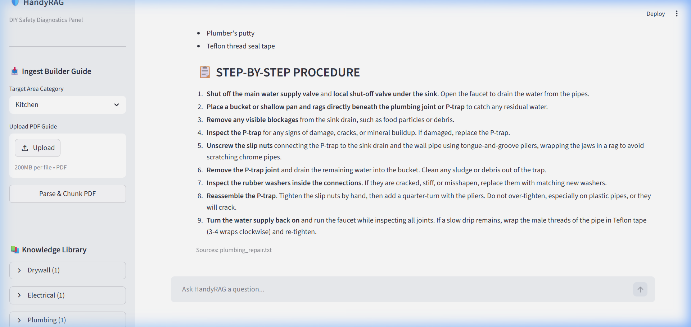
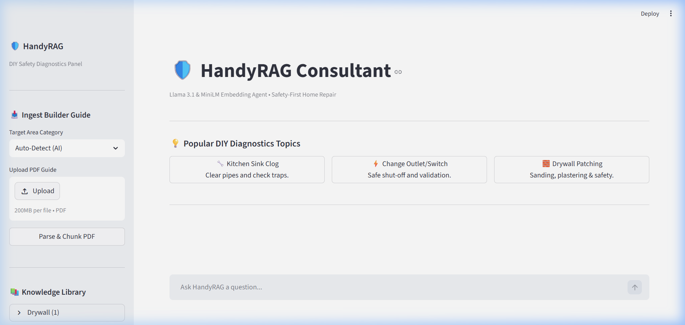

# 🛠️ HandyRAG - DIY Home Repair & Safety Advisor

Welcome to **HandyRAG**! This project is a Retrieval-Augmented Generation (RAG) application designed to assist users with DIY home repair tasks while strictly prioritizing safety. 

This repository serves as a showcase of my ability to build end-to-end AI applications using modern frameworks and Large Language Models.

---

## 📸 Project Showcase

### Main Chat Advisor Panel

### Ingestion Selector with AI Auto-Detection

---

## 🧠 Approach & Architecture

The core philosophy behind HandyRAG is **Safety-First Retrieval**. Instead of relying a generalized LLM that might hallucinate dangerous advice for electrical or plumbing work, this application grounds its answers strictly in verified builder manuals and contractor guides.

**Key Architecture Components:**
- **Frontend UI:** Built an interactive, minimalistic web interface using **Streamlit**.
- **Orchestration:** Leveraged **LangChain** to tie together document ingestion, chunking, embeddings, and LLM prompting.
- **Vector Database:** Utilized **ChromaDB** for fast, persistent local vector storage and semantic search.
- **Embeddings:** Powered by HuggingFace's `sentence-transformers/all-MiniLM-L6-v2` (running locally on CPU).
- **LLM Engine:** Integrated **Groq (Llama 3.1 8B)** for lightning-fast, high-quality generation, rigidly prompted to output mandatory safety warnings before any step-by-step instructions.

---

## 📂 Codebase Deep-Dive

Here is a breakdown of the core files and how the technologies were implemented:

### 🌟 `main.py`
This is the heart of the application, serving as both the backend logic and the **Streamlit** frontend.
- **Streamlit Integration:** Handles the UI layout, chat history state management, and real-time document upload forms.
- **LangChain Usage:** 
  - Uses `ChatGroq` for invoking the language model.
  - Implements `HuggingFaceEmbeddings` to generate query embeddings on the fly.
  - Connects to the local **ChromaDB** instance to perform `similarity_search` based on the user's chat input.
  - Dynamically constructs a strict system prompt to enforce safety formatting before injecting the retrieved context.

### 📥 `ingest.py`
This script handles the offline data pipeline, converting raw text guides into searchable vectors.
- **LangChain Usage:**
  - Uses `Document` objects to structure the incoming text data.
  - Employs `RecursiveCharacterTextSplitter` to intelligently chunk documents (800 characters with 100 character overlap) to maintain context without exceeding token limits.
  - Initializes the **ChromaDB** client (`Chroma.from_documents`) to embed and persist the vectors into the local `chroma_db/` directory.

### 📄 `requirements.txt`
A meticulously managed dependency file optimized for cloud deployment.
- Pinpoints versions for `streamlit`, `langchain`, `chromadb`, and `pypdf`.
- Includes environment-specific fixes (like `pysqlite3-binary` and a custom PyTorch CPU index URL) to ensure the app deploys flawlessly to cloud environments without Out-Of-Memory (OOM) crashes.

---

## 🎯 Key Takeaways

Building HandyRAG demonstrated my proficiency in:
- 🏗️ **Architecting RAG systems** from scratch using LangChain.
- 🗄️ **Managing Vector Databases** (ChromaDB) for persistent data retrieval.
- 🎨 **Developing intuitive UIs** rapidly with Streamlit.
- ☁️ **Troubleshooting Cloud Deployments** (managing dependency limits, SQLite versions, and OOM issues in containerized environments).
- 🛡️ **Prompt Engineering** to enforce rigid safety constraints on open-source models (Llama 3.1).
